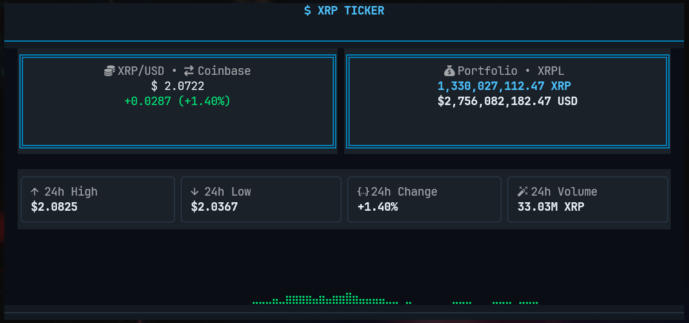

# 💎 XRP Ticker

A modern, visually stunning terminal-based XRP portfolio tracker with real-time price updates and wallet balance monitoring.


## ✨ Features

- 📈 **Real-time XRP/USD price** via Coinbase API
- 💰 **Live wallet balance** pulled directly from XRPL WebSocket (supports multiple self-custody wallets)
- 💵 **Portfolio valuation** calculated in real-time
- 🔔 **Price change indicators** with animated flash feedback
- 📊 **Sparkline chart** with multiple styles (blocks, braille, dots, line)
- 🎨 **Multiple themes** - Ripple Blue & Monokai
- 📉 **24h market stats** - High, Low, Change %, Volume (from Coinbase Exchange API)
- 🔌 **Auto-reconnect** with connection status indicators

## 🖥️ Screenshot



## 📋 Requirements

- **Python 3.11+**
- **Nerd Font** (recommended) - For best icon display, use a [Nerd Font](https://www.nerdfonts.com/) like JetBrainsMono Nerd Font in your terminal

## 🚀 Installation

```bash
# Clone the repository
git clone git@github.com:thebiglaskowski/xrp-ticker.git
cd xrp-ticker

# Create and activate a conda environment (recommended)
conda create -n xrp-ticker python=3.11
conda activate xrp-ticker

# Install the package
pip install -e ".[dev]"
```

## ⚙️ Configuration

Create a `config.toml` file in the project directory or `~/.config/xrp-ticker/`:

```toml
[wallet]
# Single wallet
addresses = ["rYourXRPAddressHere"]

# Or multiple wallets (balances are aggregated)
# addresses = ["rWallet1", "rWallet2", "rWallet3"]

[display]
theme = "ripple"  # or "monokai"

[connections]
xrpl_poll_interval = 10  # seconds between XRPL balance checks
```

> **Note:** Only self-custody wallet addresses work with this app (hardware wallets, software wallets, etc.). Exchange deposit addresses (Coinbase, Kraken, Binance, etc.) won't show your actual balance - exchanges use shared omnibus wallets with destination tags to track individual users internally.

Or initialize a config file:

```bash
xrp-ticker --init rYourXRPAddressHere
```

## 🎮 Usage

```bash
# Run with config file
xrp-ticker

# Run with a specific wallet address
xrp-ticker -w rYourXRPAddressHere

# Run with debug logging
xrp-ticker -d

# Or using environment variable
XRP_TICKER_DEBUG=1 xrp-ticker
```

## ⌨️ Keyboard Shortcuts

| Key | Action |
|-----|--------|
| `q` | 🚪 Quit application |
| `r` | 🔄 Refresh connections |
| `t` | 🎨 Cycle theme (Ripple Blue ↔ Monokai) |
| `s` | 📊 Cycle chart style |
| `d` | 🐛 Toggle debug panel |
| `?` | ❓ Show help overlay |

## 📊 Chart Styles

Press `s` to cycle through sparkline styles:

| Style | Characters | Example |
| ----- | ---------- | ------- |
| **Blocks** | `▁▂▃▄▅▆▇█` | `▁▂▃▄▅▆▇█▇▆▅▄▃▂▁` |
| **Braille** | `⣀⣤⣶⣿` | `⣀⣤⣶⣿⣶⣤⣀` |
| **Dots** | `·•●` | `·•●●•·` |
| **Line** | `⎽⎼⎻⎺` | `⎽⎼⎻⎺⎻⎼⎽` |

## 🎨 Themes

### Ripple Blue (Default)

Clean blue color scheme inspired by Ripple's branding:

- Primary: `#0085C0`
- Accent: `#4DC3FF`
- Success: `#00E676`
- Error: `#FF5252`

### Monokai

Classic dark theme with vibrant accents:

- Background: `#272822`
- Yellow: `#E6DB74`
- Orange: `#FD971F`
- Pink: `#F92672`
- Green: `#A6E22E`
- Blue: `#66D9EF`

## 🛠️ Development

```bash
# Install with dev dependencies
pip install -e ".[dev]"

# Run linter
ruff check src/

# Run formatter
ruff format src/

# Run tests
pytest
```

## 📁 Project Structure

```text
xrp-ticker/
├── src/xrp_ticker/
│   ├── __init__.py
│   ├── app.py              # Main Textual application
│   ├── config.py           # Configuration management
│   ├── models.py           # Pydantic data models
│   ├── services/           # API services
│   │   ├── coinbase.py     # Coinbase price API
│   │   └── xrpl_ws.py      # XRPL WebSocket client
│   ├── widgets/            # Textual widgets
│   │   ├── price_display.py
│   │   ├── market_stats.py
│   │   ├── sparkline.py
│   │   ├── portfolio.py
│   │   └── status_bar.py
│   └── styles/
│       └── app.tcss        # Textual CSS styles
├── config.toml
├── pyproject.toml
└── README.md
```

## 📜 License

MIT License

## 🙏 Acknowledgments

- [Textual](https://textual.textualize.io/) - TUI framework
- [Coinbase](https://www.coinbase.com/) - Price data API
- [XRPL](https://xrpl.org/) - XRP Ledger

---

Made with 💙 for the XRP community
